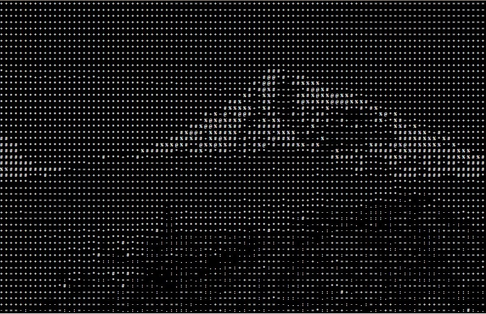

# RGB Image to ASCII Image

This project converts an RGB Image to ASCII Image using set of ASCII Characters based on grayscale lumination.

### Demo Link : [LINK](https://rajivnayanc.github.io/image_to_asccii_image/)

## Example

> INPUT Image:

 
 
 

> OUTPUT ASCII Image (width 100 characters)
 

